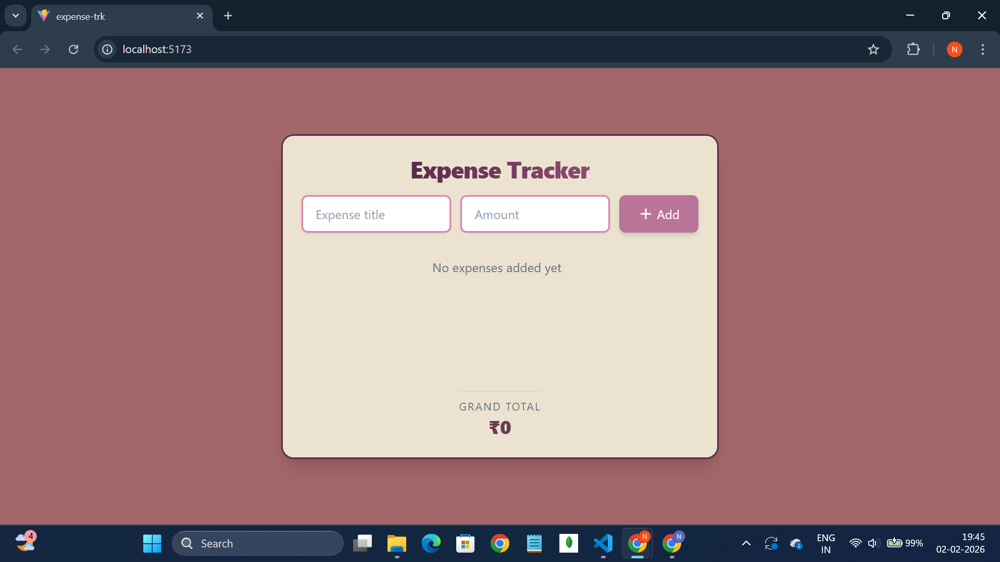
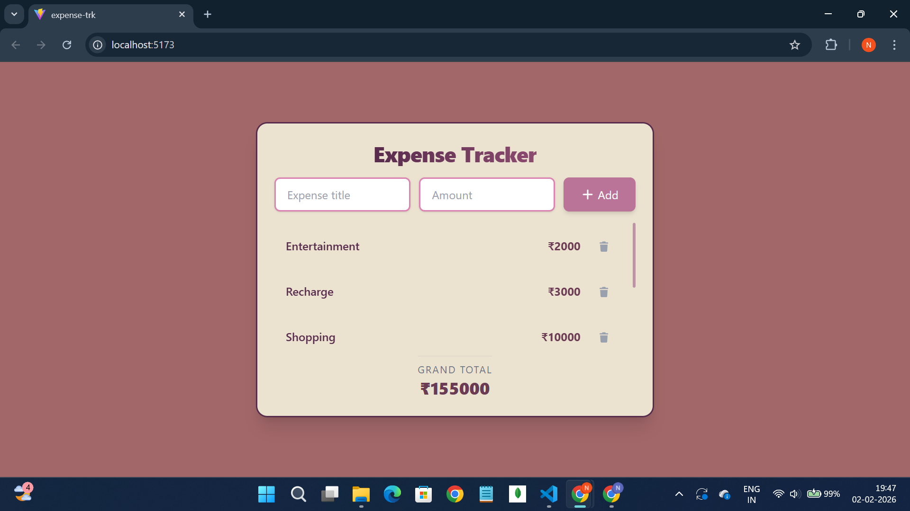

# Expense Tracker (React)

A simple expense tracker built using React fundamentals.  
This project focuses on clean state management, component structure, and basic UI/UX principles.

🔗 Live Demo: https://expensetrackerreact-self.vercel.app/  
🔗 GitHub Repo: https://github.com/Nid-debug/Expense-tracker-react

## 🚀 Features
- Add expenses with title and amount
- Delete expenses
- Scrollable expense list
- Auto-calculated total
- Sort expenses by amount
- Clean and responsive UI using Tailwind CSS

## 🧠 Concepts Used
- React components
- useState hook
- Controlled inputs
- Lifting state up
- Props (data down, actions up)
- Derived state
- Immutability (map, filter, sort)
- Conditional rendering

## 🛠 Tech Stack
- React
- Tailwind CSS
- Vite

## 📸 Screenshots

### Empty State


### With Expenses
``

## 🧪 Getting Started
```bash
npm install
npm run dev
